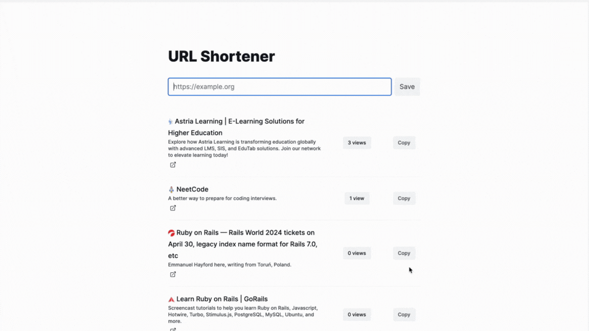

# URL Shortener

## Overview

Password Manager App is a secure and efficient tool designed to help users manage their passwords and share them with other users based on roles and permissions. Built with Ruby on Rails 7 and PostgreSQL, it leverages Devise for authentication.

## Features

- Secure password storage
- Role-based access control
- Share passwords with other users
- User authentication with Devise
- User-friendly interface

## Requirements

- Ruby 3.2.2
- Rails 7.0.5 or higher
- SQLite (why not 🙃?)

## Installation

1. **Clone the repository**

    ```bash
    git@github.com:Badara-Senpai/url-shortener.git
    cd url-shortener
    ```

2. **Install dependencies**

    ```bash
    bundle install
    ```

3. **Setup the database**

    ```bash
    rails db:create
    rails db:migrate
    ```

4. **Start the server**

    ```bash
    rails server
    ```

Visit `http://localhost:3000` in your browser to see the application.

## Usage

### Shorten a URL:
- Visit the homepage and enter the long URL you want to shorten.
- Click on the "Shorten" button to generate a shortened URL.

### View Analytics:
- Each shortened URL has a view counter that increments with every click.
- You can view the analytics for each URL by visiting the corresponding show page.

### Metadata Fetching:
- When a URL is saved, a background job is triggered to fetch metadata for the URL.
- The fetched metadata includes the favicon, description, and title of the website.
- This metadata is displayed alongside the shortened URL for a richer link preview.




## Contact

If you have any questions or suggestions, feel free to open an issue or contact me at badara.samb@outlook.com.